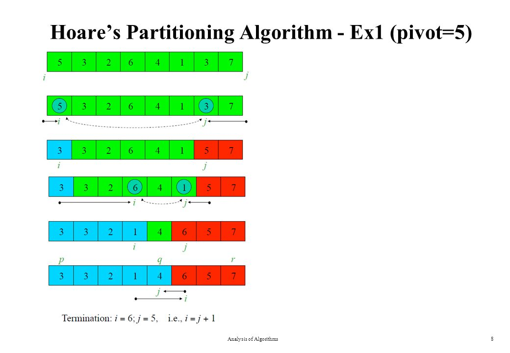

# Quicksort algorithm

### Animated visualization of the quicksort algorithm.


>Quicksort is an efficient, general-purpose sorting algorithm. Quicksort was developed by British computer scientist Tony Hoare in 1959[1] and published in 1961.[2] It is still a commonly used algorithm for sorting. Overall, it is slightly faster than merge sort and heapsort for randomized data, particularly on larger distributions.[3]
>
>Quicksort is a divide-and-conquer algorithm. It works by selecting a 'pivot' element from the array and partitioning the other elements into two sub-arrays, according to whether they are less than or greater than the pivot. For this reason, it is sometimes called partition-exchange sort.[4] The sub-arrays are then sorted recursively. This can be done in-place, requiring small additional amounts of memory to perform the sorting.
>
>Quicksort is a comparison sort, meaning that it can sort items of any type for which a "less-than" relation (formally, a total order) is defined. It is a comparison-based sort since elements a and b are only swapped in case their relative order has been obtained in the transitive closure of prior comparison-outcomes. Most implementations of quicksort are not stable, meaning that the relative order of equal sort items is not preserved.
>
>Mathematical analysis of quicksort shows that, on average, the algorithm takes 
O(nlogn) comparisons to sort n items. In the worst case, it makes 
O(n<sup>2</sup>) comparisons.


# History

The quicksort algorithm was developed in 1959 by Tony Hoare while he was a visiting student at Moscow State University. At that time, Hoare was working on a machine translation project for the National Physical Laboratory. As a part of the translation process, he needed to sort the words in Russian sentences before looking them up in a Russian-English dictionary, which was in alphabetical order on magnetic tape.[5] After recognizing that his first idea, insertion sort, would be slow, he came up with a new idea. He wrote the partition part in Mercury Autocode but had trouble dealing with the list of unsorted segments. On return to England, he was asked to write code for Shellsort. Hoare mentioned to his boss that he knew of a faster algorithm and his boss bet a sixpence that he did not. His boss ultimately accepted that he had lost the bet. Hoare published a paper about his algorithm in The Computer Journal Volume 5, Issue 1, 1962, Pages 10–16. Later, Hoare learned about ALGOL and its ability to do recursion that enabled him to publish an improved version of the algorithm in ALGOL in Communications of the Association for Computing Machinery, the premier computer science journal of the time.[2][6] The ALGOL code is published in Communications of the ACM (CACM), Volume 4, Issue 7 July 1961, pp 321 Algorithm 63: partition and Algorithm 64: Quicksort.

>Quicksort gained widespread adoption, appearing, for example, in Unix as the default library sort subroutine. Hence, it lent its name to the C standard library subroutine qsort[7] and in the reference implementation of Java.

Robert Sedgewick's PhD thesis in 1975 is considered a milestone in the study of Quicksort where he resolved many open problems related to the analysis of various pivot selection schemes including Samplesort, adaptive partitioning by Van Emden[8] as well as derivation of expected number of comparisons and swaps.[7] Jon Bentley and Doug McIlroy in 1993 incorporated various improvements for use in programming libraries, including a technique to deal with equal elements and a pivot scheme known as pseudomedian of nine, where a sample of nine elements is divided into groups of three and then the median of the three medians from three groups is chosen.[7] Bentley described another simpler and compact partitioning scheme in his book Programming Pearls that he attributed to Nico Lomuto. Later Bentley wrote that he used Hoare's version for years but never really understood it but Lomuto's version was simple enough to prove correct.[9] Bentley described Quicksort as the "most beautiful code I had ever written" in the same essay. Lomuto's partition scheme was also popularized by the textbook Introduction to Algorithms although it is inferior to Hoare's scheme because it does three times more swaps on average and degrades to O(n<sup>2</sup>) runtime when all elements are equal.[10][self-published source?] McIlroy would further produce an AntiQuicksort (aqsort) function in 1998, which consistently drives even his 1993 variant of Quicksort into quadratic behavior by producing adversarial data on-the-fly.[11]

# Algorithm

Quicksort is a type of divide-and-conquer algorithm for sorting an array, based on a partitioning routine; the details of this partitioning can vary somewhat, so that quicksort is really a family of closely related algorithms. Applied to a range of at least two elements, partitioning produces a division into two consecutive non empty sub-ranges, in such a way that no element of the first sub-range is greater than any element of the second sub-range. After applying this partition, quicksort then recursively sorts the sub-ranges, possibly after excluding from them an element at the point of division that is at this point known to be already in its final location. Due to its recursive nature, quicksort (like the partition routine) has to be formulated so as to be callable for a range within a larger array, even if the ultimate goal is to sort a complete array. 

The steps for in-place quicksort are:

 - If the range has fewer than two elements, return immediately as there is nothing to do. Possibly for other very short lengths a special-purpose sorting method is applied and the remainder of these steps skipped.
- Otherwise pick a value, called a pivot, that occurs in the range (the precise manner of choosing depends on the partition routine, and can involve randomness).
- Partition the range: reorder its elements, while determining a point of division, so that all elements with values less than the pivot come before the division, while all elements with values greater than the pivot come after it; elements that are equal to the pivot can go either way. Since at least one instance of the pivot is present, most partition routines ensure that the value that ends up at the point of division is equal to the pivot, and is now in its final position (but termination of quicksort does not depend on this, as long as sub-ranges strictly smaller than the original are produced).
- Recursively apply the quicksort to the sub-range up to the point of division and to the sub-range after it, possibly excluding from both ranges the element equal to the pivot at the point of division. (If the partition produces a possibly larger sub-range near the boundary where all elements are known to be equal to the pivot, these can be excluded as well.)


>     The choice of partition routine (including the pivot selection) and other details not entirely specified above can affect the algorithm's performance, possibly to a great extent for specific input arrays. In discussing the efficiency of quicksort, it is therefore necessary to specify these choices first. Here we mention two specific partition methods.


## Lomuto partition scheme

This scheme is attributed to Nico Lomuto and popularized by Bentley in his book Programming Pearls[12] and Cormen et al. in their book Introduction to Algorithms.[13] In most formulations this scheme chooses as the pivot the last element in the array. The algorithm maintains index i as it scans the array using another index j such that the elements at lo through i-1 (inclusive) are less than the pivot, and the elements at i through j (inclusive) are equal to or greater than the pivot. As this scheme is more compact and easy to understand, it is frequently used in introductory material, although it is less efficient than Hoare's original scheme e.g., when all elements are equal.[14] The complexity of Quicksort with this scheme degrades to O(n2) when the array is already in order, due to the partition being the worst possible one.[10] There have been various variants proposed to boost performance including various ways to select the pivot, deal with equal elements, use other sorting algorithms such as insertion sort for small arrays, and so on. 

In pseudocode, a quicksort that sorts elements at lo through hi (inclusive) of an array A can be expressed as:[13]


```c++
 // Sorts a (portion of an) array, divides it into partitions, then sorts those
algorithm quicksort(A, lo, hi) is 
  // Ensure indices are in correct order
  if lo >= hi || lo < 0 then 
    return
    
  // Partition array and get the pivot index
  p := partition(A, lo, hi) 
      
  // Sort the two partitions
  quicksort(A, lo, p - 1) // Left side of pivot
  quicksort(A, p + 1, hi) // Right side of pivot

  // Divides array into two partitions
  algorithm partition(A, lo, hi) is 
  pivot := A[hi] // Choose the last element as the pivot

  // Temporary pivot index
  i := lo

  for j := lo to hi - 1 do 
    // If the current element is less than or equal to the pivot
    if A[j] <= pivot then 
      // Swap the current element with the element at the temporary pivot index
      swap A[i] with A[j]
      // Move the temporary pivot index forward
      i := i + 1

  // Swap the pivot with the last element
  swap A[i] with A[hi]
  return i // the pivot index
```

## Hoare partition scheme

The original partition scheme described by Tony Hoare uses two pointers (indices into the range) that start at both ends of the array being partitioned, then move toward each other, until they detect an inversion: a pair of elements, one greater than the pivot at the first pointer, and one less than the pivot at the second pointer; if at this point the first pointer is still before the second, these elements are in the wrong order relative to each other, and they are then exchanged.[15] After this the pointers are moved inwards, and the search for an inversion is repeated; when eventually the pointers cross (the first points after the second), no exchange is performed; a valid partition is found, with the point of division between the crossed pointers (any entries that might be strictly between the crossed pointers are equal to the pivot and can be excluded from both sub-ranges formed). With this formulation it is possible that one sub-range turns out to be the whole original range, which would prevent the algorithm from advancing. Hoare therefore stipulates that at the end, the sub-range containing the pivot element (which still is at its original position) can be decreased in size by excluding that pivot, after (if necessary) exchanging it with the sub-range element closest to the separation; thus, termination of quicksort is ensured.

With respect to this original description, implementations often make minor but important variations. Notably, the scheme as presented below includes elements equal to the pivot among the candidates for an inversion (so "greater than or equal" and "less than or equal" tests are used instead of "greater than" and "less than" respectively; since the formulation uses do...while rather than repeat...until which is actually reflected by the use of strict comparison operators[clarification needed]). While there is no reason to exchange elements equal to the pivot, this change allows tests on the pointers themselves to be omitted, which are otherwise needed to ensure they do not run out of range. Indeed, since at least one instance of the pivot value is present in the range, the first advancement of either pointer cannot pass across this instance if an inclusive test is used; once an exchange is performed, these exchanged elements are now both strictly ahead of the pointer that found them, preventing that pointer from running off. (The latter is true independently of the test used, so it would be possible to use the inclusive test only when looking for the first inversion. However, using an inclusive test throughout also ensures that a division near the middle is found when all elements in the range are equal, which gives an important efficiency gain for sorting arrays with many equal elements.) The risk of producing a non-advancing separation is avoided in a different manner than described by Hoare. Such a separation can only result when no inversions are found, with both pointers advancing to the pivot element at the first iteration (they are then considered to have crossed, and no exchange takes place).

```c++
 // Sorts a (portion of an) array, divides it into partitions, then sorts those
algorithm quicksort(A, lo, hi) is 
  if lo >= 0 && hi >= 0 && lo < hi then
    p := partition(A, lo, hi) 
    quicksort(A, lo, p) // Note: the pivot is now included
    quicksort(A, p + 1, hi) 

// Divides array into two partitions
algorithm partition(A, lo, hi) is 
  // Pivot value
  pivot := A[lo] // Choose the first element as the pivot

  // Left index
  i := lo - 1 

  // Right index
  j := hi + 1

  loop forever 
    // Move the left index to the right at least once and while the element at
    // the left index is less than the pivot
    do i := i + 1 while A[i] < pivot
    
    // Move the right index to the left at least once and while the element at
    // the right index is greater than the pivot
    do j := j - 1 while A[j] > pivot

    // If the indices crossed, return
    if i >= j then return j
    
    // Swap the elements at the left and right indices
    swap A[i] with A[j]
```
>Hoare's scheme is more efficient than Lomuto's partition scheme because it does three times fewer swaps on average. Also, as mentioned, the implementation given creates a balanced partition even when all values are equal.[10][self-published source?], which Lomuto's scheme does not. Like Lomuto's partition scheme, Hoare's partitioning also would cause Quicksort to degrade to O(n2) for already sorted input, if the pivot was chosen as the first or the last element. With the middle element as the pivot, however, sorted data results with (almost) no swaps in equally sized partitions leading to best case behavior of Quicksort, i.e. O(n log(n)). Like others, Hoare's partitioning doesn't produce a stable sort. In this scheme, the pivot's final location is not necessarily at the index that is returned, as the pivot and elements equal to the pivot can end up anywhere within the partition after a partition step, and may not be sorted until the base case of a partition with a single element is reached via recursion. Therefore, the next two segments that the main algorithm recurs on are (lo..p) (elements ≤ pivot) and (p+1..hi) (elements ≥ pivot) as opposed to (lo..p-1) and (p+1..hi) as in Lomuto's scheme.



# Optimisation
Other important optimizations, also suggested by Sedgewick and widely used in practice, are:[18][19]

* To make sure at most O(log n) space is used, recur first into the smaller side of the partition, then use a tail call to recur into the other, or update the parameters to no longer include the now sorted smaller side, and iterate to sort the larger side.
* When the number of elements is below some threshold (perhaps ten elements), switch to a non-recursive sorting algorithm such as insertion sort that performs fewer swaps, comparisons or other operations on such small arrays. The ideal 'threshold' will vary based on the details of the specific implementation.
* An older variant of the previous optimization: when the number of elements is less than the threshold k, simply stop; then after the whole array has been processed, perform insertion sort on it. Stopping the recursion early leaves the array k-sorted, meaning that each element is at most k positions away from its final sorted position. In this case, insertion sort takes O(kn) time to finish the sort, which is linear if k is a constant.[20][12]: 117  Compared to the "many small sorts" optimization, this version may execute fewer instructions, but it makes suboptimal use of the cache memories in modern computers.[21]

# Formal analysis

## Worst-case analysis

The most unbalanced partition occurs when one of the sublists returned by the partitioning routine is of size n − 1.[26] This may occur if the pivot happens to be the smallest or largest element in the list, or in some implementations (e.g., the Lomuto partition scheme as described above) when all the elements are equal.

If this happens repeatedly in every partition, then each recursive call processes a list of size one less than the previous list. Consequently, we can make n − 1 nested calls before we reach a list of size 1. This means that the call tree is a linear chain of n − 1 nested calls. The ith call does O(n − i) work to do the partition, and $$∑i=0n(n−i)=O(n2)$$ so in that case quicksort takes O(n<sup>2</sup>) time.

## Using recurrences

The following binary search tree (BST) corresponds to each execution of quicksort: the initial pivot is the root node; the pivot of the left half is the root of the left subtree, the pivot of the right half is the root of the right subtree, and so on. The number of comparisons of the execution of quicksort equals the number of comparisons during the construction of the BST by a sequence of insertions. So, the average number of comparisons for randomized quicksort equals the average cost of constructing a BST when the values inserted 
$$(x1,x2,…,xn)$$

>We end with a short calculation:

$$E [C]=∑i∑j<i2j+1=O(∑ilog⁡i)=O(nlog⁡n).$$


## Space complexity

The space used by quicksort depends on the version used.

The in-place version of quicksort has a space complexity of O(log n), even in the worst case, when it is carefully implemented using the following strategies.
* In-place partitioning is used. This unstable partition requires O(1) space.
* After partitioning, the partition with the fewest elements is (recursively) sorted first, requiring at most O(log n) space. Then the other partition is sorted using tail recursion or iteration, which doesn't add to the call stack. This idea, as discussed above, was described by R. Sedgewick, and keeps the stack depth bounded by O(log n).[17][20]

Quicksort with in-place and unstable partitioning uses only constant additional space before making any recursive call. Quicksort must store a constant amount of information for each nested recursive call. Since the best case makes at most O(log n) nested recursive calls, it uses O(log n) space. However, without Sedgewick's trick to limit the recursive calls, in the worst case quicksort could make O(n) nested recursive calls and need O(n) auxiliary space.

From a bit complexity viewpoint, variables such as lo and hi do not use constant space; it takes O(log n) bits to index into a list of n items. Because there are such variables in every stack frame, quicksort using Sedgewick's trick requires O((log n)2) bits of space. This space requirement isn't too terrible, though, since if the list contained distinct elements, it would need at least O(n log n) bits of space.

Another, less common, not-in-place, version of quicksort uses O(n) space for working storage and can implement a stable sort. The working storage allows the input array to be easily partitioned in a stable manner and then copied back to the input array for successive recursive calls. Sedgewick's optimization is still appropriate.

# References

* Sedgewick, R. (1978). ["Implementing Quicksort programs"](https://sedgewick.io/wp-content/themes/sedgewick/papers/1978Implementing.pdf). Comm. ACM. 21 (10): 847–857. doi:10.1145/359619.359631. S2CID 10020756.
* Dean, B. C. (2006). ["A simple expected running time analysis for randomized 'divide and conquer' algorithms"](https://www.sciencedirect.com/science/article/pii/S0166218X05001599). Discrete Applied Mathematics. 154: 1–5. doi:10.1016/j.dam.2005.07.005.
* Hoare, C. A. R. (1961). ["Algorithm 63: Partition".](https://dl.acm.org/doi/pdf/10.1145/366622.366642) Comm. ACM. 4 (7): 321. doi:10.1145/366622.366642. S2CID 52800011.
* Hoare, C. A. R. (1961). ["Algorithm 65: Partition".](https://dl.acm.org/doi/pdf/10.1145/366622.366642). Comm. ACM. 4 (7): 321–322. doi:10.1145/366622.366647.
* Hoare, C. A. R. (1962). ["Quicksort"](https://watermark.silverchair.com/050010.pdf?token=AQECAHi208BE49Ooan9kkhW_Ercy7Dm3ZL_9Cf3qfKAc485ysgAAA1EwggNNBgkqhkiG9w0BBwagggM-MIIDOgIBADCCAzMGCSqGSIb3DQEHATAeBglghkgBZQMEAS4wEQQMh1G-yiHpVXMjmAa0AgEQgIIDBMlzmDLapFOi4em2IB9vPeLXDWQXh3xoCLfUH7L5RWgUGeKdcufSUTBjKmfM7J7JO7AAeNvx-lKAMa4kuCWhn07koh2yX3NNgLiefi3XdmkfeHYrB6_wNQnoTUzT76RGYw5Un8HJh29j4bibasiQWNIh1UlGCF3OgJ96p0Mh5N_mSlFyI48NYuj4es44GvwjrlpJhIsYGiDBkQnt4doMWaGfOL_rFU4nhyqyzzanYp_yRTvUhdXs3cm2SrA7WYQq71oUhOtEGxehaZHklYXVHkRmsyk14V0tTU7HwRRe6YdZLbv8l45SCvkHyxRQ9IAYEuMR1L_qFoJC_73bFI98eT8kA3eNcnuOzI75AZkzkOKcUI_-CCpZYX6rTJEyEkFT-L5dlmdTt3zog6tTFPv01tLcFmOTtdb4r1r97TcXmDOd3oAPE9npxZj03OueUB4514VlU1LmvhDODVAiuaqXOycA_zXhyf5IUkHggbWVgfb6yZqToArKZlyu5VGJ0JYaxyWRYKT8elDdpk-CHzSTtlVWN6qqG2HDcS0w0W3WlAq9JIJzSQgEu5mQ9W0XtMMMaURicn88a5dbyoPS-1MoKcaZdSx2J6kIusfb_t3vrl1FyB7-Ws0DSfHZS5rDfYNh1kBM1WPDr7wjBW-P2aT1EjNF6VjApoB967PC-khgo50tF_HfBs65qMGUC7tOECjEI3_56NU2xiYaTgOq_xLCiHiVnmdCjjlTn4sH_PfF3ZlMzZ-iB4bi97X2Ufvn7769HB2WnLrNi305ovuqA98CHzHDFblMuk1_PwLCDkH4TB49DQxjLYUN29YJmGNTKuG9qVfroQrajeZysYdYWPZBqeLroe0yD8A0qLewt0kH4zBjY08E5iHHH3bNHW_e8SOAotMOkscpL0aiYFBCFZxcrry_bEZ9kNduQgYw3nwyRxW2XWgH4YqlB5Zul3Bc9QyjQJuvPg9tUFqjmlBiO56OO8MzgBzbSZslhLajFxW-SUjZt8DCrDqFi1EbvNAWJuujlrGu73I). Comput. J. 5 (1): 10–16. doi:10.1093/comjnl/5.1.10. (Reprinted in Hoare and Jones: Essays in computing science, 1989.)