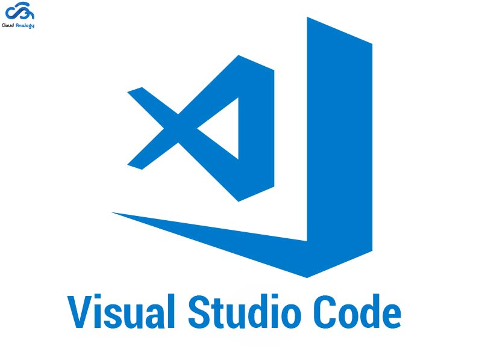
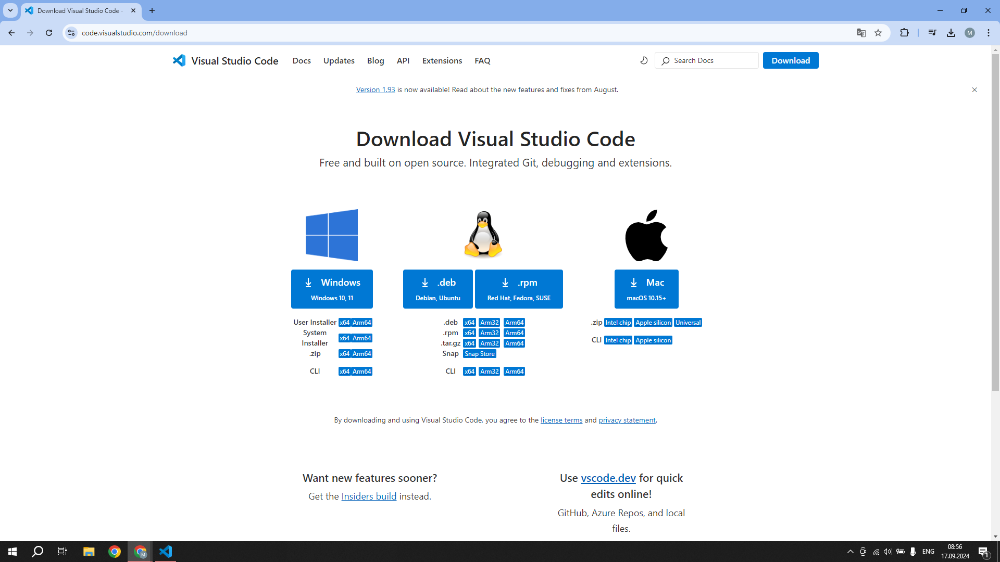
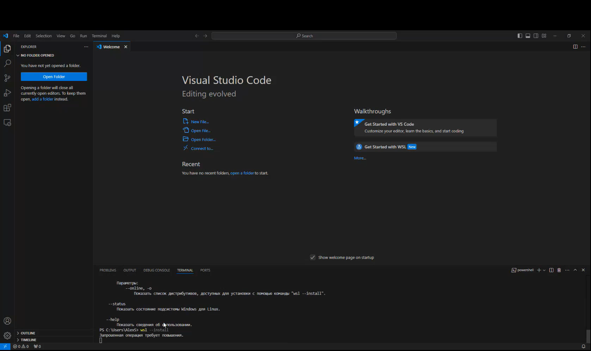
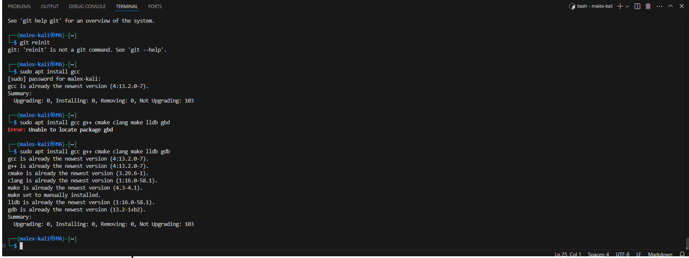
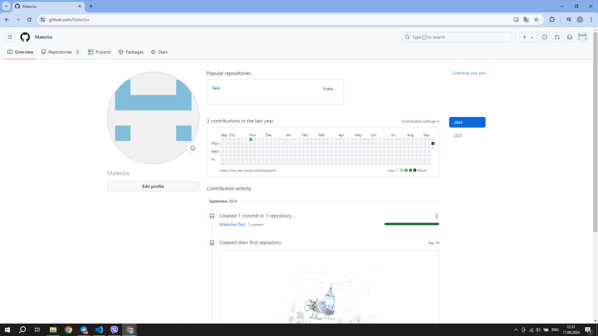
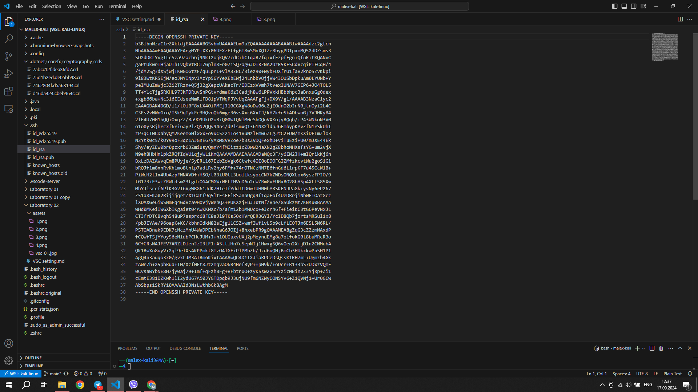
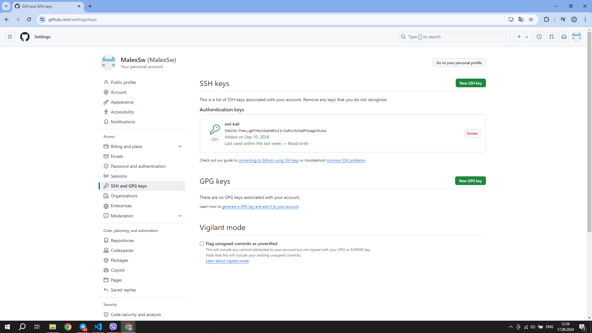

# Visual studio code set up process

## Setupping process

### Downloading
#### I begun process of Visual Studio Code setupping from downloading. So as I have Windows 10, I downloaded it configuration for Windows from official website.

#### After this I unpacked downloaded file, setupped and in forst time opened Visual studio code.

### First setup

#### I begun my work in Visual Studio Code with WSL installing. I made a request and downloaded it.

#### After this extension was installed I have gone to the Kali-linux. I also was downloaded, installed and setupped - created username "malex-kali" and password. 
After this my Visual Studio setup was at least ended, I only needed to download some extensions.

### Languages downloading

#### The final one step was downloading languages - gcc g++ cmake clang make lldb gdb with command *sudo apt install*

### Github

#### The last one step was connecting GitHub account to the visual studio cod. Firstly I created a Git hub Account.

#### Than I generated SSH key 

#### And finally connected it to the Github. 

## Problems during the process

#### During my Visual Studio Code setupping I had some problems, some of which:

* Problem with begin ( I misunderstood how to begin and spent a lot of time to find and than download WSL extension)

* Problem with languages downloading - firstly I have skipped one important step with kali-linux downloading and lost a lot of time, working with this question

* Question with PDF-convertion. Firstly I couldn't convert my markdown files into PDF, because didn't have some extensions.

## Conclusion

#### Proces of Visual Studio setupping was very interesting for me. Even though I have found some troubles in the process, I think that it was very important experience for me. 